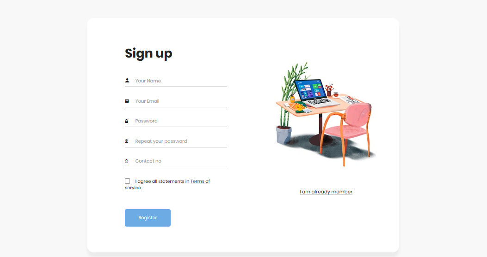
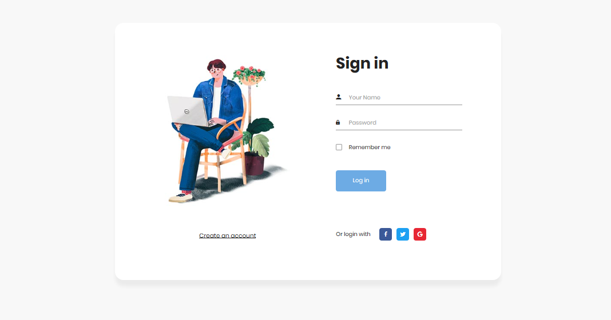

# SecureSign: Java-based User Authentication System

## Introduction
Welcome to SecureSign, a robust java based user authentication system developed using Java, JSP, Java Servlets, and SQL. This project ensures secure and seamless registration and login experiences. 
With a focus on reliability and data integrity, JavaGuard provides a foundation for building secure web applications with user management capabilities.

## Dependencies

* [Java Editor](https://www.eclipse.org/downloads/), [mysql](https://www.mysql.com/downloads/), [Apache Tomcat Server](https://tomcat.apache.org/)
* You're requested to check your own port, I am using port 8082 for running my server.

* First, clone the repository and enter the folder

  ```bash
  git clone https://github.com/jaymehta1811/SecureSign.git
  cd SecureSign
  ```
  
*The folder structure is shown in the snapshot attached in this readme file.

* The snapshot of the output is given below:

  
  
  

  


